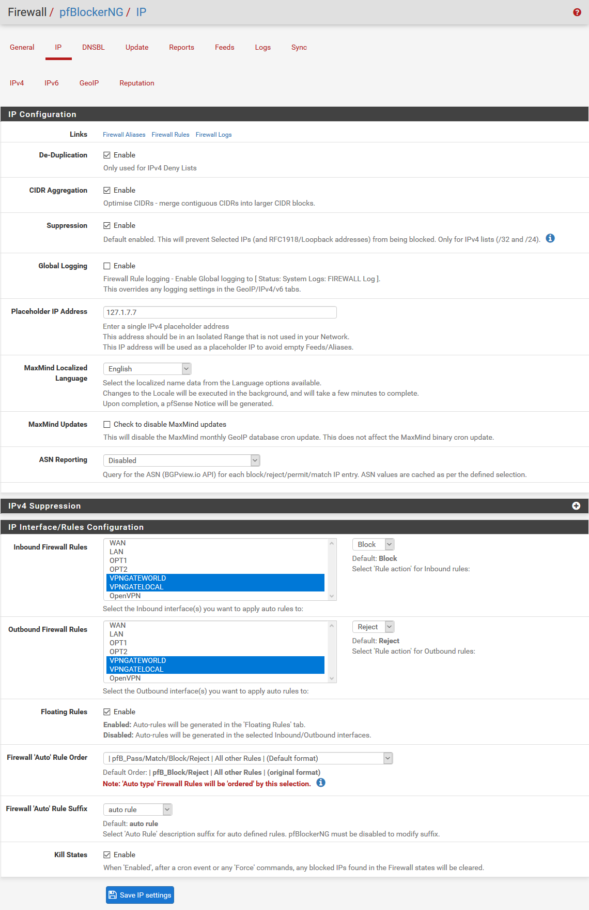
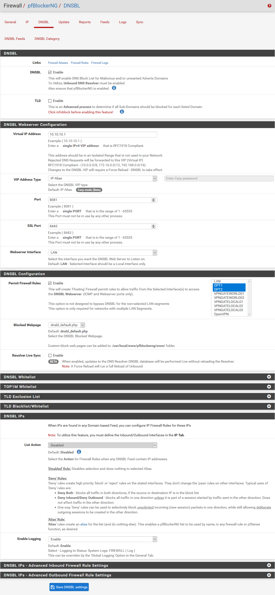

<h1>pfSense-pfBlockerNG</h1>

pfBlockerNG is a pfSense package for extending the standard firewall’s capabilities beyond the traditional stateful L2/L3/L4 firewall.

pfBlockerNG provides pfSense with the ability for the firewall to make allow/deny decisions based on items such as the geolocation of an IP address, the domain name of a resource, or the Alexa ratings of particular websites. 

This guide sets up pfBlockerNG for all OpenVPN Gateways (VPNGGATEWORLD and VPNGATELOCAL). 

If you don’t already have an internal LAN network block-list functionality in place I would strongly suggest installing PiHole.

**Prerequisites**

Network prerequisites are:
- [x] Layer 2 Network Switches
- [x] Network Gateway is `192.168.1.5`
- [x] Network DNS server is `192.168.1.5` (Note: your Gateway hardware should enable you to configure DNS server(s), like a UniFi USG Gateway, so set the following: primary DNS `192.168.1.254` which will be your PiHole server IP address; and, secondary DNS `1.1.1.1` which is a backup Cloudfare DNS server in the event your PiHole server 192.168.1.254 fails or os down)
- [x] Network DHCP server is `192.168.1.5`

Other Prerequisites are:
- [x] Proxmox node fully configured as per [PVE Host Setup](https://github.com/ahuacate/proxmox-node/blob/master/README.md#proxmox-node-building)
- [x] pfSense is fully configured as per [pfSense - Setup](https://github.com/ahuacate/pfsense-setup/blob/master/README.md#pfsense---setup)

<h4>Table of Contents</h4>

# Install pfBlockerNG Package
In the pfSense WebGUI go to `System` > `Package Manager` > `Available Packages` and type ‘pfblocker’ into the search criteria and then click `Search`.

Make sure you click `+ Install` on the version with ‘-devel’ (i.e pfBlockerNG-devel) at the end of it, and then `Confirm` on the next page. Installation may take a short while as it downloads and updates certain packages.

## MaxMind GeoIP Registration
To utilize the MaxMind GeoIP functionality, you must first register for a free MaxMind user account. Visit the following [Link](https://www.maxmind.com/en/geolite2/signup) to Register for a free MaxMind user account. Utilize the GeoIP Update version 3.1.1 or newer registration option.

In the `License key description` field name the license key "pfBlocker". Utilize the GeoIP Update version 3.1.1 or newer registration option. Confirm. Copy/paste the new "License Key" into into a safe file for use later in the pfBlockerNG setup (Note, you must immediately copy the key on the page to get the full key length).

# Configure General Settings
At this point, you have already installed the package. Next, you will need to enable it from pfSense WebGUI `Firewall` > `pfBlockerNG` and the option to exit out of the wizard. A configuration page should appear, Click on the `General Tab`, and fill out the necessary fields as follows:

| General Settings | Value | Value | Value | Value | Notes
| :---  | :--- | :--- | :--- | :--- | :---
| pfBlockerNG | `☑` Enable | 
| Keep Settings | `☑` Enable |
| CRON Settings | Once a day | 00 | 0 | 0 | *Generally Leave Default settings*

Then Click `Save` at the bottom of the page.

# Configure IP Settings
Go to pfSense WebGUI `Firewall` > `pfBlockerNG` > `IP Tab` and fill out the necessary fields as follows. Whats NOT shown in the below table leave as default.

| IP Configuration | Value | Other Values | Notes
| :---  | :--- | :--- | :---
| De-Duplication | `☑` Enable | |*Check*
| CIDR Aggregation | `☑` Enable ||*Check*
| Suppression | `☑` Enable ||*Check*
| Global Logging | `☐` ||*Uncheck*
| Placeholder IP Address | 127.1.7.7||*Leave Default*
| ASN Reporting | `Disabled`
| **MaxMind GeoIP configuration**
| MaxMind License Key | `Insert Maxmind Key` || *See instructions at 1.01*
| MaxMind Localized Language | English||*Leave Default*
| MaxMind CSV Updates | `☐` Check to disable MaxMind CSV updates ||*Uncheck*
| **IP Interface/Rules Configuration**
| Inbound Firewall Rules | `VPNGATEWORLD01` || *Select ONLY VPNGATEWORLD and VPNGATELOCAL*
|| `VPNGATEWORLD02` | Block
|| `VPNGATELOCAL01`
|| `VPNGATELOCAL02`
|| `VPNGATELOCAL03`
| Outbound Firewall Rules | `VPNGATEWORLD01` || *Select ONLY VPNGATEWORLD and VPNGATELOCAL*
|| `VPNGATEWORLD02` | Reject |
|| `VPNGATELOCAL01`
|| `VPNGATELOCAL02`
|| `VPNGATELOCAL03`
| Floating Rules | ☑ Enabled || *Check*
| Firewall 'Auto' Rule Order | pfB_Pass/Match/Block/Reject\All other Rules\(Default Format) || *Leave Default*
| Firewall 'Auto' Rule Suffix | `auto rule`
| Kill States | `☑` Enable

And click `Save IP Settings`

# Configure DNSBL Settings
If you have multiple internal interfaces (2x + Gigabit NICs) you would want to protect them with DNSBL, so you will need to pay attention to the ‘Permit Firewall Rules’ section.

## Enable DNSBL

If your pfSense OS has plenty of memory enable, 4Gb or more, you may enable TLD. If not, DO NOT enable TLD. 

So what is TLD? Normally, DNSBL (and other DNS blackhole software) block the domains specified in the feeds. What TLD does differently is it will block the domain specified in addition to all of a domain’s subdomains. As a result, a intrusive domain can’t circumvent the blacklist by creating a random subdomain name such as abcd1234.zuckermine.com (if zuckermine.com was in a DNSBL feed). If you have the RAM enable it - although I choose not to.

Next, go to pfSense WebGUI `Firewall` > `pfBlockerNG` > `DNSBL Tab` and fill out the necessary fields as follows. What's NOT shown in the below table leave as default. 

| DNSBL | Value | Other Values | Notes
| :---  | :--- | :--- | :---
| DNSBL | `☑` Enable 
| DNSBL Mode | `Unbound mode`
| Wildcard Blocking (TLD) | `☐` Enable | | *Note: You need at least 4Gb of RAM for this feature*
| Resolver Live Sync | `☐` Enable | 
| **DNSBL Webserver Configuration**
| Virtual IP Address | `10.10.10.1`
| IPv6 DNSBL | `☐` Enable
| DNSBL VIP Type | `IP Alias` 
| Webserver Interface | `LAN`
| Port | 8081
| SSL Port | 8443
| **DNSBL Configuration**
| Permit Firewall Rules | `☑` Enable |`OPT1` | *Select ONLY OPT1 and OPT2 - Use the Ctrl key to toggle selection*
||| `OPT2`
| Global Logging/Blocking Mode | `No Global mode`
| Blocked Webpage | dnsbl_default.php
| Resolver cache | `☑` Enable 
| **DNSBL IPs**
| List Action | `Disabled`

Now click `Save DNSBL settings` at the bottom of the page.

## Configure DNSBL feeds
Using the pfSense WebGUI  `Firewall` > `pfBlockerNG` > `Feeds Tab` (not DNSBL Feeds) at the top, you will see all of the pre-configured feeds for the IPv4, IPv6, and DNSBL categories.

Scroll down to the `DNSBL Category` header then to the Alias/Group labeled `ADs`. Click the blue colour **`+`** next to the `ADs` header (column should be all ADs) to add all the feeds related to ADs category. Note, if you instead clicked the `+` to the far right of each line, you will instead only add that individual feed - this is not what we want.

| Category | Alias/Group | Feed/Website | Header/URL
| :---  | :--- | :--- | :---
| **DNSBL Category**
| DNSBL `I` **`+`** | `ADs` | `Adaway` | `Adaway`

If you clicked the **`+`** next to the ADs category, you are taken to a `DNSBL feeds` page with all of the feeds under that category pre-populated. All of the feeds in the list will initially be in the `OFF` state. You can go through and enable each one individually or you can click `Enable All` at the bottom of the list - then all will switch/change to `ON` state. Then change the Action field to `Unbound`.

Next, make sure you switch the `Action` from Disabled to `Unbound`.

| Value | Value | Value | Value
| :---  | :--- | :--- | :---
| **DNSBL Source Definitions**
| `Auto` | `ON` | `https://adaway.org/hosts.txt` | `Adaway`
| **Settings**
| Action | `Unbound`

Now Click the `Save DNSBL Settings` at the bottom of the page and you should receive a message at the top along the lines of `Saved [ Type:DNSBL, Name:ADs ] configuration`.

To check all went okay go to the `Firewall` > `pfBlockerNG` > `DNSBL` > `DNSBL Feeds` tab and you will see a DNSBL feeds summary. Your feeds summary should look similar to the one below:

| Name | Description | Action | Frequency | Logging
| :---  | :--- | :--- | :--- | :---
| **DNSBL Feeds Summary**
| ADs | ADs - Collection | Unbound | Once a day | Enabled

Now lets add some more. Go back to `Firewall` > `pfBlockerNG` > `Feeds` tab up top and then scroll down to `DNSBL category` section again. We’re going to add another category (after making some changes), but let’s explain everything you see here. Looking at the `DNSBL Catergory` you’ll see the `ADs` category checkmark **`+`** is replaced with a :heavy_check_mark: means this category already exists and is active in the DNSBL ADs category. This distinction is important to recognize because when you add the next category we do not need to enable every feed for a particular category.

Also worth mentioning before we add the `Malicious` category. Some feeds have selectable options such as feed category `Internet Storm Center`. I recommend switching the feed from `ISC_SDH` (high) to `ISC_SDL` (low) as the high feed has under 20 entries and the low feed includes the high feed.

After making the switch to `ISC_SDL`, click the blue colour **`+`** next to the `Malicious` header (column should be all Malicious) to add all the feeds related to that category.

If you clicked the **`+`** next to the Makicious category, you are taken to a `DNSBL feeds` page with all of the feeds under that category pre-populated. As when we added the ADs list, go ahead and click `Enable All` at the bottom of the list - all will switchchange to `ON` state. Then change the Action field to `Unbound`. **Don’t hit save just yet!**

**Important:** Now look for any `Header/label` called **`Pulsedive`** and/or **`Malekal`** and delete them (they were not there in my pfBlockerNG version). You don't want these as they are subscription (paid) services. On deletion they will disappear.

Now Click the `Save DNSBL Settings` at the bottom of the page and you should receive a message at the top along the lines of `Saved [ Type:DNSBL, Name:ADs ] configuration`.

To check all went okay go to the `Firewall` > `pfBlockerNG` > `DNSBL` > `DNSBL Feeds` tab and you will see a DNSBL feeds summary. Your feeds summary should look similar to the one below:

| Name | Description | Action | Frequency | Logging
| :---  | :--- | :--- | :--- | :---
| **DNSBL Feeds Summary**
| ADs | ADs - Collection | Unbound | Once a day | Enabled
| Malicious | Malicious - Collection | Unbound | Once a day | Enabled

Now lets add some more. Go back to `Firewall` > `pfBlockerNG` > `Feeds` and scroll down to the `DNSBL Category` header then to the Alias/Group labeled `Easylist`. Click the blue colour **`+`** next to the `Easylist` header (column should be all Easylist) to add all the feeds related to that category. You are taken to a `DNSBL feeds` page with all of the feeds under that category pre-populated. 

**Important:** Now look for any `Header/label` called `EasyPrivacy` and delete it. On deletion the line will disappear.

All of the feeds in the list will initially be in the `OFF` state. You can go through and enable each one individually or you can click `Enable All` at the bottom of the list - all will switch/change to `ON` state. Then change the Action field to `Unbound` and the Update Frequency to `Every 4 hours`.

Now Click the `Save DNSBL Settings` at the bottom of the page and you should receive a message at the top along the lines of `Saved [ Type:DNSBL, Name:ADs ] configuration`.

Now repeat the procedure for:
*  BBcan177 - From the creater of pfBlockerBG. Make sure its the Alias/group labeled `BBcan177`.
*  hpHosts (all of them) - From Malwarebytes
*  BBC (BBC_DGA_Agr) – From Bambenek Consulting
*  Cryptojackers (all of them) – This blocks cryptojacking software and in-browser miners, but it also blocks various coin exchanges.

After adding all of the above go to the `Firewall` > `pfBlockerNG` > `DNSBL` > `DNSBL Feeds` tab and you will see a DNSBL feeds summary. Your feeds summary should look similar to the one below:

| Name | Description | Action | Frequency | Logging
| :---  | :--- | :--- | :--- | :---
| **DNSBL Feeds Summary**
| ADs | ADs - Collection | Unbound | Once a day | Enabled
| Malicious | Malicious - Collection | Unbound | Once a day | Enabled
| hpHosts | Malwarebytes - Collection | Unbound | Once a day | Enabled
| BBcan177 | BBcan177 - Collection | Unbound | Once a day | Enabled
| BBC | BBC-DGA type - Collection | Unbound | Once a day | Enabled
| Cryptojackers | Cryptojackers - Collection | Unbound | Once a day | Enabled
| Easylist | EasyList Feeds | Unbound | Every 4 hours | Enabled

## Force DNSBL Feed Updates
You need to force a update to to `Reload` DNSBL new or changed settings. You must do this to check if your pfBlockerNG is working.

Next go to pfSense WebGUI `Firewall` > `pfBlockerNG` > `Update Tab` and fill out the necessary fields as follows. Whats NOT shown in the below table leave as default. 

| Update Settings | Value | Vale | Value | Notes
| :---  | :--- | :--- | :--- | :---
| Links 
| Select Force option | `☐` Update | `☐` Cron | `☑` Reload | *Select Reload*
| Select Reload option | `☑` All | `☐` IP | `☐` DNSBL | *Select All*

Now Click the `RUN` below the options and you should see the Logs being created on the page. It may take a while. Be patient.

# Check if pfBlockerNG is working
First connect a device (i.e mobile, tablet etc) to either *.vpngate-local or *vpngate-world network. Go and browse a few websites with advertising - for example, a news website. Then go to pfSense WebGUI `Firewall` > `pfBlockerNG` > `Reports` > `Alerts Tab` and you should see the DNSBL entry being populated with intercepted data. 

| Date | IF | Source | Domain/Referer/URI/Agent | Feed
| :---  | :--- | :--- | :--- | :---
| **DNSBL Section**
 Jul 26 10:49:13 [65]|OPT2|192.168.40.151|graph.instagram.com [ DNSBL ]S|Yoyo
 ||| Galaxy-Note8|DNSBL-HTTP|DNSBL_ADs
|Jul 26 11:06:05|OPT2|192.168.40.151|connect.facebook.net [ TLD ]|AntiSocial_BD
||||DNSBL-HTTPS | |DNSBL_Malicious

If you see nothing in the DNSBL section then pfBlockerNG is NOT working. Check your configurations for DNS resolve. Remember after any edits or changes always perform a pfBlockerNG Update by following the procedures in **4.03 Force DNSBL Feed Updates**.

If I am left scratching my heading wondering what I've done wrong, I find deleting and recreating the pfSense firewall floating rules fixes things. My procedure is as follows:
*  Step 1: Go to pfSense WebGUI `Firewall` > `pfBlockerNG` > `General Tab` and disable pfBlockerNG. Click `Save` at the bottom of the page.
*  Step 2: Next go to pfSense WebGUI `Firewall` > `pfBlockerNG` > `DNSBL Tab` and disable DNSBL. Click `Save` at the bottom of the page.
*  Step 3: Next go to pfSense WebGUI `Firewall` > `Rules` > `Floating Tab` and delete all 3 rules and click `Save`.
*  Step 4: Next go to pfSense WebGUI `Diagnostics` > `States` > `Reset States` select `Reset the firewall state table` and click `Reset`.
*  Step 5: Re-enable `pfBlockerNG` and `DNSBL` shown in Step 1 and 2.
*  Step 6: Now perform a pfBlockerNG Update by following the procedures in **4.03 Force DNSBL Feed Updates**.

Another MUST DO step is the creation of DNS Accept and Block Firewall rules for your network interface(s) shown [HERE](https://github.com/ahuacate/pfsense-setup/blob/master/README.md#905-dns-allow-and-block-rules-on-opt1---vpngate-world).

# Patches and Fixes
