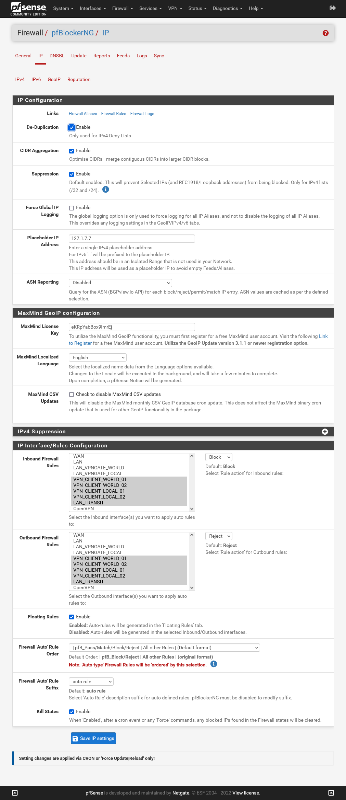
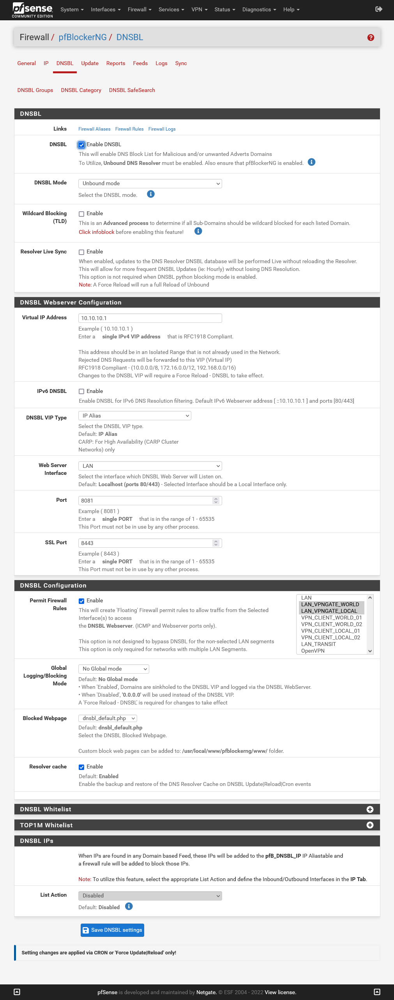
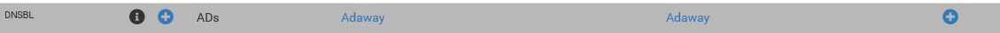
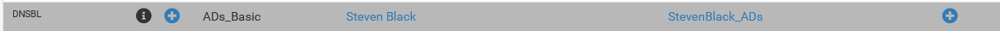
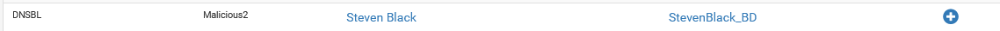
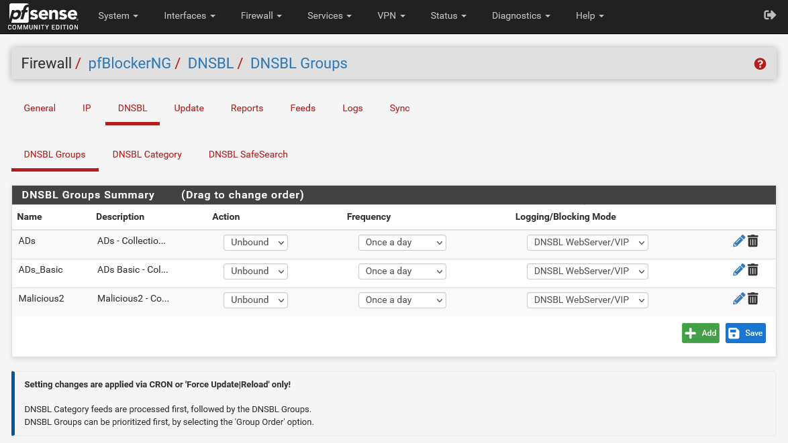
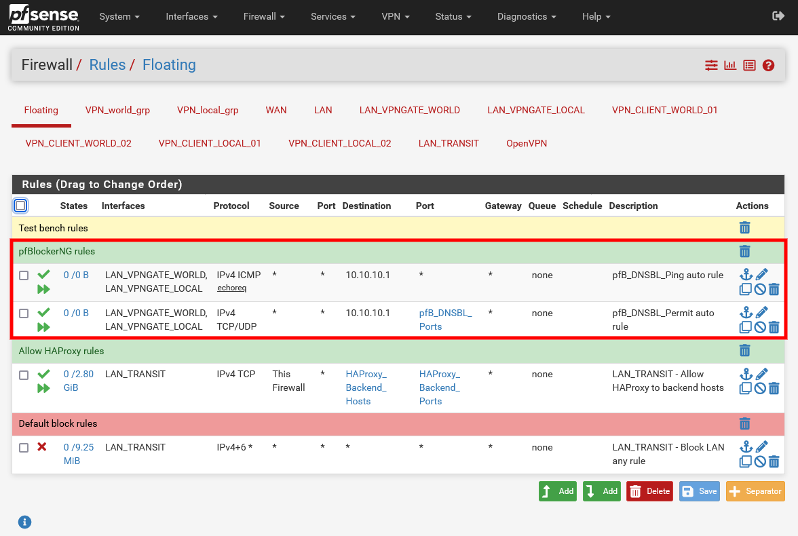

<h1>pfSense-pfBlockerNG</h1>

This is a guide for pfSense add-on pfBlockerNG.

pfBlockerNG is a pfSense package for extending the standard firewall’s capabilities beyond the traditional stateful L2/L3/L4 firewall.

pfBlockerNG provides pfSense with the ability for the firewall to make allow/deny decisions based on items such as the geolocation of an IP address, the domain name of a resource, or the Alexa ratings of particular websites. 

This guide sets up pfBlockerNG for OpenVPN Gateways (LAN-vpngate-world and LAN-vpngate-local). 

If you don’t already have an internal LAN network block-list functionality in place I would strongly suggest installing PiHole.

**Prerequisites**

- [ ] Proxmox hosts fully configured as per guide: [PVE Host Setup](https://github.com/ahuacate/pve-host) (Recommended)
- [x] pfSense is fully configured as per guide: [pfSense Setup](https://github.com/ahuacate/pfsense-setup)

<h4>Table of Contents</h4>

<!-- TOC -->

- [1. Install pfBlockerNG Package](#1-install-pfblockerng-package)
- [2. MaxMind GeoIP Registration](#2-maxmind-geoip-registration)
- [3. Configure General Settings](#3-configure-general-settings)
- [4. Configure IP Settings](#4-configure-ip-settings)
- [5. Configure DNSBL Settings](#5-configure-dnsbl-settings)
    - [5.1. Enable DNSBL](#51-enable-dnsbl)
- [6. Configure DNSBL feeds](#6-configure-dnsbl-feeds)
    - [6.1. Adding Feeds](#61-adding-feeds)
    - [6.2. Force DNSBL Feed Updates](#62-force-dnsbl-feed-updates)
- [7. Check pfBlockerNG](#7-check-pfblockerng)
- [8. Patches and Fixes](#8-patches-and-fixes)

<!-- /TOC -->

# 1. Install pfBlockerNG Package
Navigate using the pfSense WebGUI to `System` > `Package Manager` > `Available Packages` and type ‘pfblocker’ into the search criteria and then click `Search`.

Make sure you click `+ Install` on the version with ‘-devel’ (i.e pfBlockerNG-devel) at the end of it, and then `Confirm` on the next page. Installation may take a short while as it downloads and updates certain packages.

# 2. MaxMind GeoIP Registration
To utilize the MaxMind GeoIP functionality, you must first register for a free MaxMind user account. Visit the following [Link](https://www.maxmind.com/en/geolite2/signup) to Register for a free MaxMind user account. Utilize the GeoIP Update version 3.1.1 or newer registration option.

In the `License key description` field name the license key "pfBlocker". Utilize the GeoIP Update version 3.1.1 or newer registration option. Confirm. Copy/paste the new "License Key" into into a safe file for use later in the pfBlockerNG setup (Note, you must immediately copy the key on the page to get the full key length).

# 3. Configure General Settings
Navigate using the pfSense WebGUI to `Firewall` > `pfBlockerNG` > `General` and fill out the necessary fields as follows.

| General Settings | Value | Value | Value | Value
| :---  | :--- | :--- | :--- | :--- 
| pfBlockerNG | `☑` Enable
| Keep Settings | `☑` Enable
| CRON Settings | Once a day | 00 | 0 | 0

Click `Save` at the bottom of the page.

# 4. Configure IP Settings
Navigate using the pfSense WebGUI to `Firewall` > `pfBlockerNG` > `IP Tab` and fill out the necessary fields as follows. Whats NOT shown in the below table leave as default.

| IP Configuration | Value | Other Values
| :---  | :--- | :---
| De-Duplication | `☑` Enable
| CIDR Aggregation | `☑` Enable
| Suppression | `☑` Enable
| Global Logging | `☐`
| Placeholder IP Address | 127.1.7.7
| ASN Reporting | `Disabled`
| **MaxMind GeoIP configuration**
| MaxMind License Key | `Insert Maxmind Key`
| MaxMind Localized Language | English
| MaxMind CSV Updates | `☐` Check to disable MaxMind CSV updates
| **IP Interface/Rules Configuration**
| Inbound Firewall Rules | `VPNGATEWORLD01` | Block
|| `VPNGATEWORLD02`
|| `VPNGATELOCAL01`
|| `VPNGATELOCAL02`
|| `VPNGATELOCAL03`
| Outbound Firewall Rules | `VPNGATEWORLD01` | Reject
|| `VPNGATEWORLD02`
|| `VPNGATELOCAL01`
|| `VPNGATELOCAL02`
|| `VPNGATELOCAL03`
| Floating Rules | ☑ Enabled
| Firewall 'Auto' Rule Order | pfB_Pass/Match/Block/Reject\|All other Rules\|(Default Format)
| Firewall 'Auto' Rule Suffix | `auto rule`
| Kill States | `☑` Enable

And click `Save IP Settings`

# 5. Configure DNSBL Settings
If you have multiple internal interfaces you would want to protect them with DNSBL, so you will need to pay attention to the ‘Permit Firewall Rules’ section.

## 5.1. Enable DNSBL

If your pfSense OS has plenty of memory enable, 4Gb or more, you may enable TLD. If not, DO NOT enable TLD. 

So what is TLD? Normally, DNSBL (and other DNS blackhole software) block the domains specified in the feeds. What TLD does differently is it will block the domain specified in addition to all of a domain’s subdomains. As a result, a intrusive domain can’t circumvent the blacklist by creating a random subdomain name such as abcd1234.zuckermine.com (if zuckermine.com was in a DNSBL feed). If you have the RAM enable it - although I choose not to.

Navigate using the pfSense WebGUI to `Firewall` > `pfBlockerNG` > `DNSBL Tab` and fill out the necessary fields as follows. What's NOT shown in the below table leave as default. 

| DNSBL | Value | Other Values | Notes
| :---  | :--- | :--- | :---
| DNSBL | `☑` Enable 
| DNSBL Mode | `Unbound mode`
| Wildcard Blocking (TLD) | `☐` Enable | | Note: You need at least 4Gb of RAM for this feature
| Resolver Live Sync | `☐` Enable | 
| **DNSBL Webserver Configuration**
| Virtual IP Address | `10.10.10.1`
| IPv6 DNSBL | `☐` Enable
| DNSBL VIP Type | `IP Alias` 
| Webserver Interface | `LAN`
| Port | 8081
| SSL Port | 8443
| **DNSBL Configuration**
| Permit Firewall Rules | `☑` Enable
||`LAN_VPNGATE_WORLD`
||`LAN_VPNGATE_LOCAL`
| Global Logging/Blocking Mode | `No Global mode`
| Blocked Webpage | dnsbl_default.php
| Resolver cache | `☑` Enable 
| **DNSBL IPs**
| List Action | `Disabled`

Now click `Save DNSBL settings` at the bottom of the page.

# 6. Configure DNSBL feeds

pfBlockerNG uses pre-configured feeds for the IPv4, IPv6, and DNSBL categories blocking malicious content, advertisements and alike. pfBlockerNG has a vast selection of IP feeds you can enable.

As a starter we add the DNSBL Steven Black and Adaway feed lists.

## 6.1. Adding Feeds

Navigate using the pfSense WebGUI to `Firewall` > `pfBlockerNG` > `Feeds Tab` (not DNSBL Feeds) at the top, you will see all of the pre-configured feeds for the IPv4, IPv6, and DNSBL categories.

Scroll down to the header category labelled `DNSBL`. Add the following lists by clicking on the blue colour **`+`** on the far right of each entry. You will redirected to a settings page.

| Category | Alias/Group | Feed/Website | Header/URL
| :---  | :--- | :--- | :---
| DNSBL | ADs | Adaway | Adaway
| DNSBL | ADs_Basic | Steven Black | StevenBlack_ADs
| DNSBL | Malicious | Steven Black | StevenBlack_BD

The feed  will initially be in the `OFF` state. Set all the fields as shown below.

| Value | Value | Value | Value
| :---  | :--- | :--- | :---
| **DNSBL Source Definitions**
| `Auto` | `ON` | `https://adaway.org/hosts.txt` | `Adaway`
| **Settings**
| Action | `Unbound`
| Update Frequency | `Once per day`

Click  `Save DNSBL Settings` at the bottom of the page.

Repeat for all 3 feed sources.

Navigate using the pfSense WebGUI to  `Firewall` > `pfBlockerNG` > `DNSBL` > `DNSBL Groups`  and check your feeds are configured as shown.

## 6.2. Force DNSBL Feed Updates
After configuring your feeds you need to perform a `update` to enable the new settings.

Navigate using the pfSense WebGUI to `Firewall` > `pfBlockerNG` > `Update` and click `Run`.

| Update Settings | Value
| :---  | :--- 
| Select Force option | `☐` Update `☐` Cron `☑` Reload 
| Select Reload option | `☑` All `☐` IP `☐` DNSBL

And click `RUN`. You should see the Logs being created on the page. It may take a while. Be patient.

# 7. Check pfBlockerNG
Connect any device (i.e mobile, tablet etc) to the LAN-vpngate-local or LAN-vpngate-world network. Go and browse a few websites with advertising. Then go to pfSense WebGUI `Firewall` > `pfBlockerNG` > `Reports` > `Alerts Tab` and you should see the DNSBL entry being populated with intercepted data.

If you see nothing in the DNSBL section then pfBlockerNG is NOT working. Check your configurations for DNS resolve. Remember after any edits or changes always perform a pfBlockerNG Update.

Also check your pfSense Firewall Rules. Two floating pfB_DNSBL should had been created.

If I am left scratching my head I take the following action. Navigate using the pfSense WebGUI to `Diagnostics` > `States` > `Reset States` select `Reset the firewall state table` and click `Reset`.

# 8. Patches and Fixes
